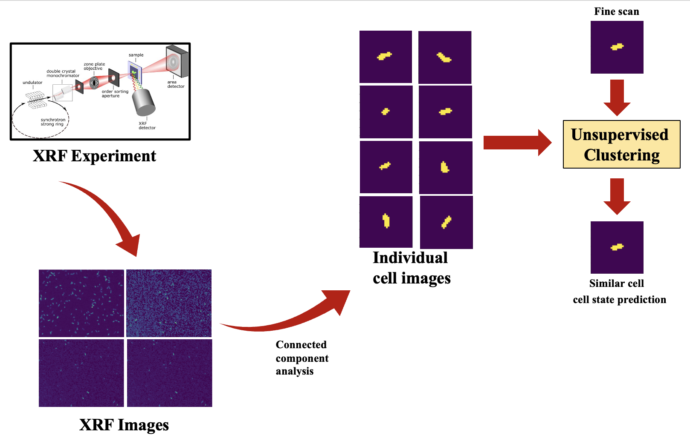

ROI-Finder
=====================================
The regions of interest (ROI) finder tool groups bacterial cells into two classes corresponding to their live and dead state.

Install
========

Clone from GitHub and install dependencies listed in .yaml file.

.. code-block:: python

    git clone https://github.com/arshadzahangirchowdhury/ROI-Finder.git
    python setup.py install

Content
^^^^^

.. toctree::
   :maxdepth: 2
   
   About
   License
   Help
   Acknowledgements

   modules

.. Indices and tables
.. ==================

.. * :ref:`genindex`
.. * :ref:`modindex`
.. * :ref:`search`
